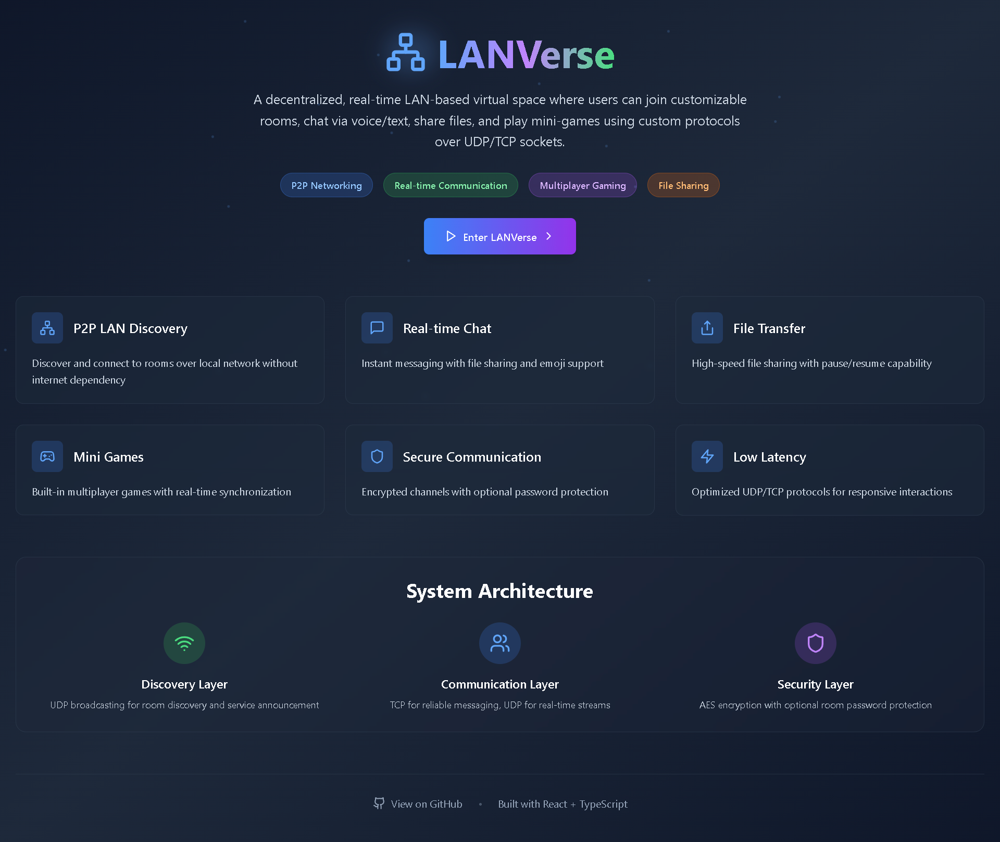
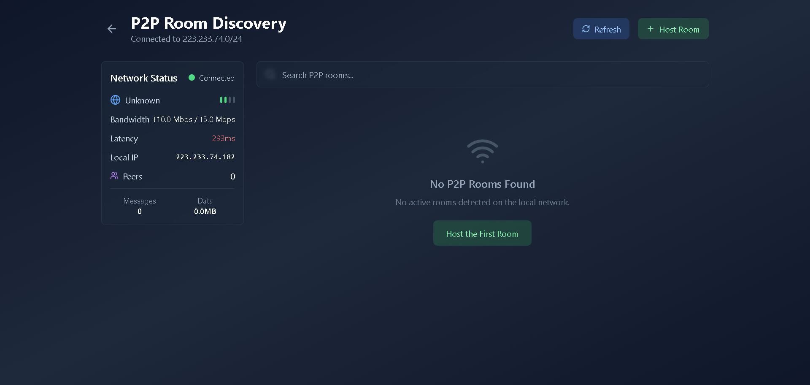
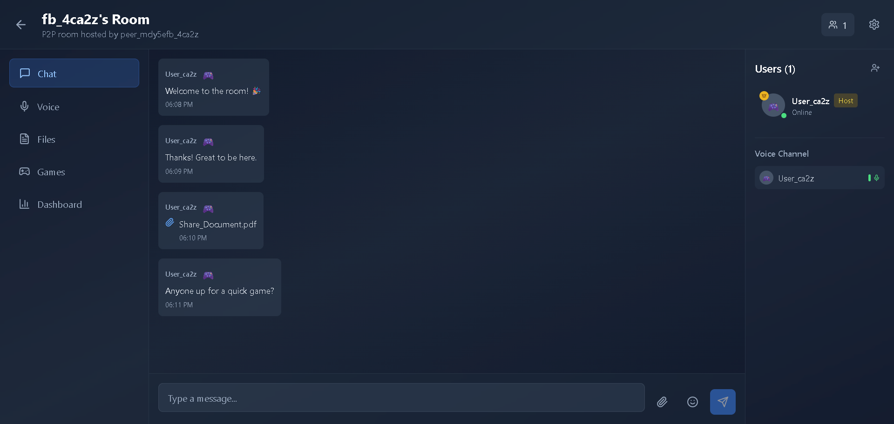
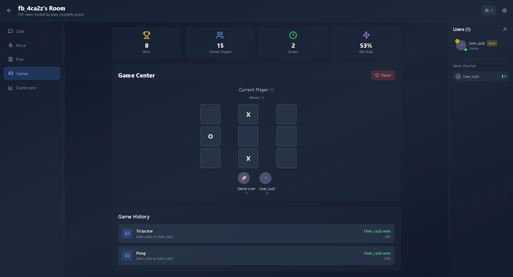
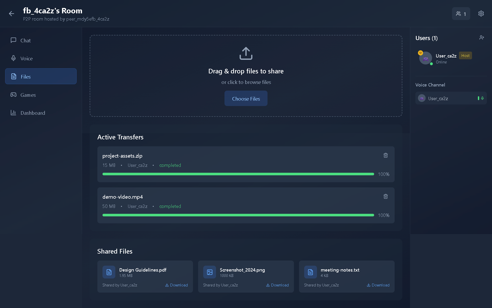
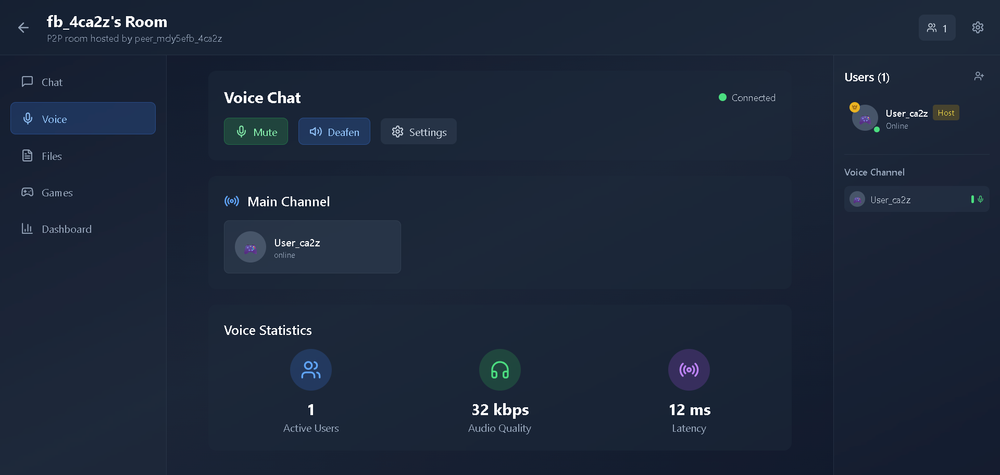

# 🧠 LANVerse – Peer-to-Peer LAN Metaverse Platform

**One-liner:**  
A decentralized, real-time LAN-based virtual space where users can join customizable rooms, chat via voice/text, share files, and play mini-games using custom protocols over UDP/TCP sockets.

---

## 🧩 Brief Summary

LANVerse is a peer-to-peer (P2P) LAN-based virtual platform simulating a mini-metaverse. Users can discover hosts over LAN, join shared virtual rooms, communicate in real-time via voice and chat, share files, and collaboratively play mini-games. Built on custom networking protocols, it uses concurrent socket programming to handle multiple real-time services like voice, file-sharing, and multiplayer game data streams.

**Why LANVerse?**  
Unlike centralized systems, LANVerse runs entirely on your local network—perfect for demos, offline campuses, game nights, or team collaborations without the internet.

---

## ⚙️ Key Technical Components

| Component               | Description                                                                 |
|-------------------------|-----------------------------------------------------------------------------|
| Custom Protocol Design  | Message headers, session handling, packet types (text, audio, game input), error recovery |
| UDP for Real-Time       | Audio/game data using fast, lossy connections                               |
| TCP for Reliability     | Chat, file sharing, and metadata                                            |
| Concurrency             | Multi-threaded socket handling per service                                  |
| P2P Room Discovery      | UDP broadcasting for available rooms & services                             |
| Fault Tolerance         | Timeout/retry logic, dropped packet compensation, leader election           |
| Local DB/Cache (opt.)   | Store session states or resume interrupted file transfers                   |

---

## 💻 Languages & Tools

- **Frontend:** React + TypeScript + TailwindCSS ([src/](src/))
- **Backend (suggested):** Python / Go / Rust (for sockets, concurrency, protocol)
- **Sockets API:** socket, select, or async libraries (e.g., asyncio in Python)
- **Voice Chat:** pyaudio, webrtc, or sounddevice
- **File Sharing:** Chunked file protocol with pause/resume
- **GUI:** Web (React) or desktop (Tkinter/Electron/Godot)
- **Debugging:** Wireshark for protocol inspection

---

## 🚀 Advanced Features & Extensions

| Feature                  | Description                                                      |
|--------------------------|------------------------------------------------------------------|
| Mini Multiplayer Game SDK| Embed real-time games (tic-tac-toe, pong, etc.) over sockets     |
| Encrypted Communication  | TLS or AES encryption for voice/chat streams                     |
| File Resume System       | Resume interrupted downloads with chunk indexing                  |
| Room Host Failover       | Leader election (e.g., Bully Algorithm) for room persistence     |
| LAN Whiteboard           | Collaborative whiteboard via UDP drawing events                  |
| Service Visualization    | Web dashboard for room data, packet flow, node topology          |
| Voice Activity Detection | Efficient streaming using speech detection                       |
| Packet Inspector CLI     | Inspect LANVerse traffic, debug messages, replay sessions        |

---

## ✅ Suggested Repository Structure

```
/LANVerse/
├── docs/            # Diagrams, protocol design, architecture
├── server/          # Room host logic
├── client/          # UI + connection logic (see [src/](src/))
├── protocol/        # Custom packet formats & utils
├── file_share/      # Resume logic
├── voice_chat/      # Real-time audio logic
├── game_engine/     # Mini-games over UDP
├── tests/           # Unit & integration tests
└── README.md        # Setup, protocol docs, usage demo
```
---

## 🏁 Quick Start (Frontend Demo)

1. **Install dependencies:**
   ```sh
   npm install
   ```
2. **Run the development server:**
   ```sh
   npm run dev
   ```
3. **Open [http://localhost:5173](http://localhost:5173) in your browser.**

> **Note:**  
> The current frontend ([src/](src/)) is a React/TypeScript demo simulating the LANVerse UI and flows. Backend networking logic (sockets, protocol, etc.) should be implemented in your preferred language as described above.

---

## 📸 Screenshots

Below are some screenshots of the LANVerse platform in action:

### MainPage 


### Rooms


### Chat


### Gaming


### File Share


### Voice


### DashBoard


---

## 🤝 Contributing

PRs and issues welcome! See [CONTRIBUTING.md](docs/CONTRIBUTING.md) for guidelines.

---

## 📄 License

MIT License

---

## ⭐️ Star this repo if you like the project!
